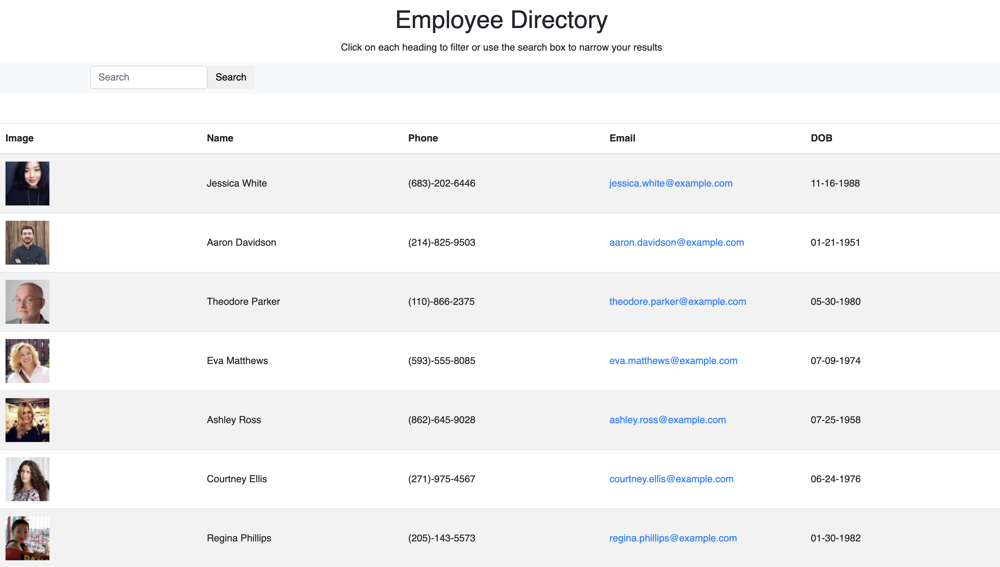

# Employee Directory

# **Project Description**
A React app to view an employee directory. The app allows users to search by employee name or sort alphabetically.

# **Live Link**
[Deployed Github Page](https://msplawn.github.io/Employee-Directory/)

# **Screencaps:**
  

# **Demo Video:**
[https://drive.google.com/file/d/14WEZr3UDoO_JL0FRaq95SaZQsA1a63d0/view]

# **Installation**
Download the zip file and unzip it. Open the files and run npm install to intall the required dependencies. Then run npm start and navigate to your local host. Alternatively you can use the app in browser on the deployed Github page listed above.

# **Technology Stack**
* React
* HTML
* CSS
* JavaScript
* Node

# **Contact**
* ### **Name:**  Morgan Splawn
* ### **Github:**  [@msplawn](https://github.com/msplawn)
* ### **Email:**  [mmsplawn@gmail.com](msplawn@gmail.com)
* ### **LinkedIn:**  [https://www.linkedin.com/in/morgan-splawn-72979a1a9/](https://www.linkedin.com/in/morgan-splawn-72979a1a9/)

